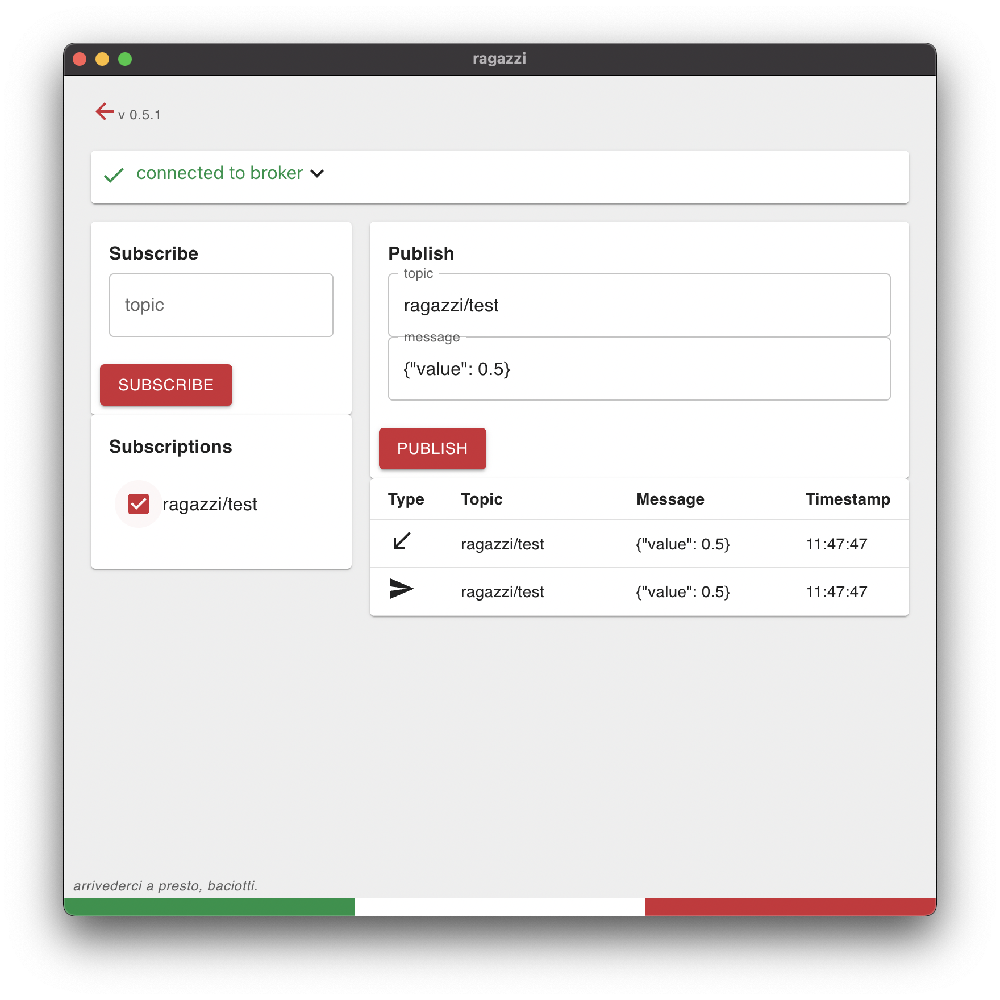
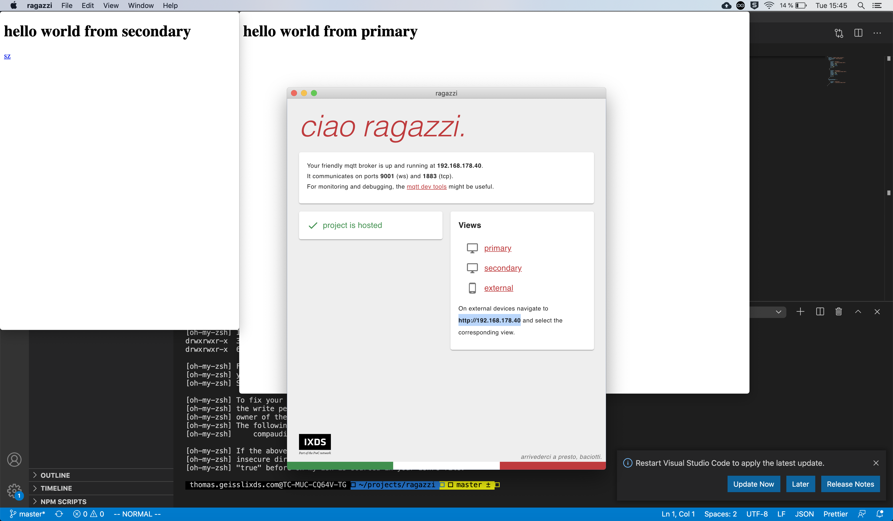

# ragazzi

## Description

ragazzi is a mqtt broker bundled as an electron app. it is equipped with a webserver to serve your projects. see the multiple example how to write ragazzi files.

The broker will listen on ports 9001 (ws) and 1883 (tcp).

## Screenshots



## Installation
Ragazzi can be downloaded from the [releases](https://github.com/ixds/ragazzi/releases) page.

On osx it can be installed via brew.
```
brew tap thomasgeissl/tools
brew install --cask ragazzi
```
## Development

- npm install
- npm run electron-dev
- npm run electron-build

## Publishing payloads

The publisher keeps its existing raw UTF-8 text and JSON modes. In raw mode, choose an
encoding when the receiver expects binary data:

- **UTF-8 text** — sends the entered text as UTF-8 (the default).
- **hex bytes** — enter byte pairs such as `7f 00 ff`.
- **Base64 bytes** — enter Base64 data such as `fw==`.
- **unsigned byte** — enter one decimal value from `0` through `255`; for example,
  entering `127` sends one byte, `0x7f`, rather than the three UTF-8 characters `127`.

Malformed hex, Base64, and unsigned-byte values are not published. Binary messages in
the activity log are labeled with their encoding and can be replayed without changing
their wire bytes.

## Desktop release CI

Tag pushes (`x.y.z` or `vx.y.z`) run [`.github/workflows/release.yml`](.github/workflows/release.yml): tests, then package Windows / macOS / Linux and upload artifacts to the GitHub Release.

macOS builds are signed and notarized (same Developer ID flow as gsc-app). Required repository secrets:

| Secret | Purpose |
| --- | --- |
| `APPLE_CERTIFICATE` | Base64-encoded `.p12` (Developer ID Application) |
| `APPLE_CERTIFICATE_PASSWORD` | Password used when exporting the `.p12` |
| `KEYCHAIN_PASSWORD` | Temporary CI keychain password |
| `APPLE_ID` | Apple ID email |
| `APPLE_PASSWORD` | App-specific password ([appleid.apple.com](https://appleid.apple.com)) |
| `APPLE_TEAM_ID` | 10-character Team ID from the developer portal |

Reuse the same values from gsc-app / NeopixelBlocks if those repos already have them. Without the Apple secrets, the macOS job fails at certificate import.

## Tests

Unit tests use [Vitest](https://vitest.dev/) (co-located `src/**/*.test.ts`):

- `npm test` — run once
- `npm run test:watch` — watch mode
- `npm run test:coverage` — coverage report under `coverage/`

End-to-end tests use [Playwright](https://playwright.dev/) against Electron (starts Vite on port 3000):

- `npm run test:e2e` — full Electron suite
- `npm run test:e2e:smoke` — `@smoke` tests only

On Linux CI, e2e runs under `xvfb-run`.

## Support

If you find ragazzi useful, you can support development:

[](https://buymeacoffee.com/thomasgeissl)
