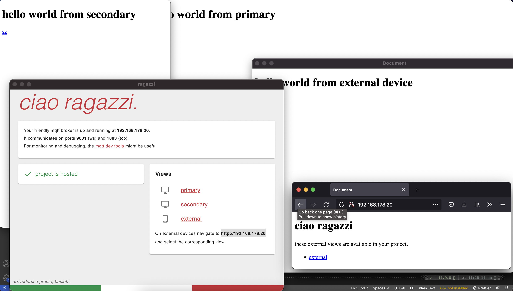

# ragazzi

## Description

ragazzi is a mqtt broker bundled as an electron app. it is equipped with a webserver to serve your projects. see the multiple example how to write ragazzi files.

The broker will listen on ports 9001 (ws) and 1883 (tcp).

This is still a work in progess.

## Screenshots



## Installation
Ragazzi can be downloaded from the [releases](https://github.com/ixds/ragazzi/releases) page.

On osx it can be installed via brew.
```
brew tap thomasgeissl/tools
brew install --cask ragazzi
```
## Dev

- yarn install
- yarn electron-dev
- yarn electron-dist
